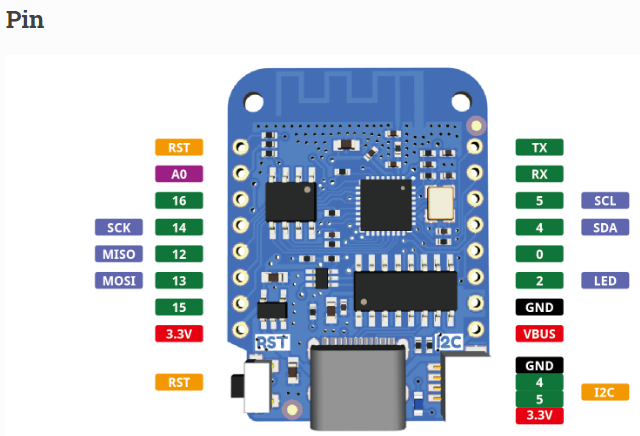

# 1. WIFI Module - Lolin D1 Mini
[YouTube 링크](https://www.youtube.com/watch?v=nsmJlFtE8w4&list=PLJG0s98ECJWX3fJhhhsXWMIzIr00dd2tY&index=5 "Lolin 강의")
> ## Check Point 
- SSID에서 2.4GHz인지 확인하기 [5GHz는 지원하지 않음]
- PHY 모드, 채널의 GHz확인하기.


--------------------
> ## 코드 설명

```    
WiFi.begin("network-name", "pass-to-network");
```
- "network-name"    : WiFi ID

- "pass-to-network" : WiFi PWD

```
while(WiFi.status() != WL_CONNECTED);
```
- WiFi에 접속이 될때 까지 .을 찍는다는 뜻
  
```
WiFi.localIP();
```
- 접속된 와이파이의 주소를 띄워주는 명령어
---
<div style="page-break-after: always"></div>

# 2. WiFi 쉴드 종류
[YouTube 링크](https://www.youtube.com/watch?v=3BqdMjGL3kw&list=PLJG0s98ECJWX3fJhhhsXWMIzIr00dd2tY&index=5 "Lolin 쉴드")

- **Motor** : 모터 드라이버 
- **OLED**: 액정이 있는 모델
- **Barometric Pressure**: 기압, 온도 측정
- **TFT 2.4 touch**: 2.4인치 터치 스크린
- **Battery**: 프로버전의 리튬 건전지를 Mini에서 지원함
- **Dual, Tripler Base**: 횡방향 쉴드 보드
- **PIR**: PIR센서
- **Micro SD Card**: SD 카드
- **IR Controller**: 리모트 컨트롤 (적외선 송수신)
- **Ambient Light**: BH1750 조도 센서
- **DHT**: 온도, 습도 측정
- **Relay**: 외부 전자기기 On/Off 제어
- **Matrix LED**: 매트릭스 형태의 LED
- **Buzzer** : beep음을 냄
- **WS2812B RGB** : 네오픽셀이 1개
- **RGB LED** : 네오픽셀이 7개
- **ProtoBoard** : 다른 부품을 연결해서 보드 제작하고 싶을 때 사용
- **1 button** : 1 버튼 쉴드
- **DC Power** : DC잭을 연결해서 Power를 공급할 때 쓰임

[공식 Docs](https://www.wemos.cc/en/latest/d1_mini_shield/index.html "Wemos 쉴드 공식 Docs")

-----

<div style="page-break-after: always"></div>

# 3. PIN Numbering

[YouTube 링크](https://www.youtube.com/watch?v=1IoTI3q-owc&list=PLJG0s98ECJWX3fJhhhsXWMIzIr00dd2tY&index=6 "Lolin 쉴드")

> ### GPIO (General Purpose Input Output) = 다용도 입출력
- Arudino Uno의 Power, DIGITAL PWM, ANALOG IN의 핀들이 해당 됨.

```
ex) pinMode(14,OUTPUT); // A0의 pin을 Digital pin처럼 사용한다.
```

<center>
    
</center>

----
> ### Wemos Lolin D1 mini v4.0 ESP8266 - GPIO 위치 
<br />

<center>
    
</center>

- all of the IO pins run at 3.3V
- GPIO 대신 D0, D1 이런식으로도 설정 가능하다. (예제 마다 GPIO와 Pin번호가 다르게 사용 될 수 있다.) </br>
```
ex) pinMode(D1, OUTPUT);
```

<div style="page-break-after: always"></div>

# 4. Es8266 - Server & LED Blinking

[YouTube 링크](https://www.youtube.com/watch?v=3XhPvLlpggo&list=PLJG0s98ECJWX3fJhhhsXWMIzIr00dd2tY&index=7 "예제")

```
ESP8266WebServer server(80); // 기본적으로 웹이 사용하는 No. (80)
```
- 단순하게 Server Numbering 해주는 작업
```
// 모듈 주소에 접속 했을 때, 가장 짧은 기본 주소를 뜻하는 '/'
server.on("/",handleRoot); 
```

- server를 on 시키면서 동시에 '/'를 입력하여 가장 짧은 주소를 불러온다.
- 이후 handleRoot(임의로 만든 def)를 실행시킨다는 뜻.
```
server.begin();
```
- 실질적으로 서버를 실행시키는 역할 (코드를 작성 한 후 끝에 작성)
```
void handleRoot() {
    digitalWrite(led,LOW);
    server.send(200,"text/plain", "hello from esp8266!");
    digitalWrite(led,HIGH);
}
```
- "text/plain" : HTML(다양한 문서내용 저장 방식) 형식으로 오른쪽의 "hello ~"를 내보내겠다는 뜻.
- 이후 ```digitalWrite```(led,HIGH)으로 LED를 꺼준다는 뜻.</br> 
(ESP8266은 +극이 VCC, -극이 IO핀에 연결되어 LOW 했을 때 LED가 켜지게 된다.)

```
void loop() {
    server.handleClient();
}
```
- 주기적으로 반복적으로 실행 해야 한다.</br>
  (없으면 웹 브라우저 접속을 해도 반응을 안한다, 루프에 필수적으로 있어야 하는 것)
> 동일 네트워크 주소라면 핸드폰에서도 가능하다.
```
ex) 192.xxx.x.xxx // 모바일로 접속 시에 blinking
```

<div style="page-break-after: always"></div>

# 5. 원격 IOT 조명 만들기

[YouTube 링크](https://www.youtube.com/watch?v=2o5ZxyU2YB4&list=PLJG0s98ECJWX3fJhhhsXWMIzIr00dd2tY&index=8 "예제")

> ### Shield
- Relay 쉴드를 활용하여 외부 제어를 돕는다.
- Dual Base로 연결 가능한 공간을 만들어준다.

> ### 추가 된 Code
```
server.on("/on", handleOn);  //on 에 접속 됐을 때 실행할 함수 연결
server.on("/off",handleOff); //off 에 접속 됐을 때 실행할 함수 연결
```
- 4.와 다르게 server.on 방식이 2개가 됐다.
```
void handleOn(){ // "/on" 에 접속할 땐
    // D1을 HIGH로 바꾸고
    digitalWrite(D1, HIGH); 
    // "BULB ON" 메세지를 보낸다.
    server.send(200, "text/plain", "BULB ON"); 
}

void handleOff(){ // "/off" 에 접속할 땐
    // D1을 LOW로 바꾸고
    digitalWrite(D1, LOW);
    // "BULB OFF" 메세지를 보낸다.
    server.on(200, "text/plain", "BULB OFF")
}
```


-----

# JSON(ESP8266) 전송방식

https://arduinojson.org/

-----
<script type="text/javascript" src="http://cdn.mathjax.org/mathjax/latest/MathJax.js?config=TeX-AMS-MML_HTMLorMML"></script>
<script type="text/x-mathjax-config"> MathJax.Hub.Config({ tex2jax: {inlineMath: [['$', '$']]}, messageStyle: "none" });</script>


